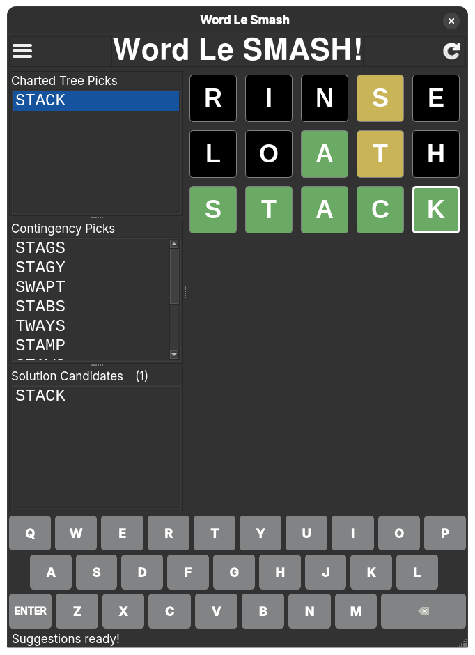

# Word Le SMASH!

## About
A PyQT 6-based Wordle solver that uses decision trees to find optimal picks for Wordle and similar games.


## Table of Contents ##

<table>
  <tr>
    <td>
      <ul>
        <li><a href="#getting-started">Getting Started</a></li>
        <li><a href="#features">Features</a></li>
        <li><a href="#usage">Usage</a></li>
        <li><a href="#requirement">Requirements</a></li>
        <li><a href="#contributing">Contributing</a></li>
        <li><a href="#license">License</a></li>
        <li><a href="#acknowledgements">Acknowledgements</a></li>
      </ul>
      <br><br>
      There is no greater delight <br>
      than hacking and coding all night. <br>
      With heuristic revision <br>
      and trees of decision, <br>
      You'll gain puzzle solving insight.<br>
      <br><br>
    </td>
    <td style="vertical-align: top; padding-left: 20px;">
      
    </td>
  </tr>
</table>


## Getting Started

### Installation

To install Word Le SMASH!, you'll need Python and PyQT 6 installed on your system. Install the required dependencies using pip:

```bash
pip install numpy scipy joblib sortedcontainers pyqt6
```

### Setup

To set up Word Le SMASH!, clone the repository and run the application:

```bash
git clone https://github.com/moltencrux/wordlesmash.git
cd wordlesmash
python wordlesmash.py
```

## Features

- PyQT 6-based graphical user interface
- Decision tree-based Wordle solver
- Support for pre-computed and real-time generated decision trees

## Usage

### Graphical User Interface

To use Word Le SMASH! via the graphical user interface:

1. Enter your chosen word into the input boxes, duplicating the word you chose in your actual game.
2. Click each box to cycle through the color clues, matching the colors from your actual game:
   - **Black/Gray**: Not in the word
   - **Yellow**: In the word, but not in the correct position
   - **Green**: In the word and in the correct position
3. After entering the color clues, the application will generate a new pick and display a list of all possible remaining solutions.
4. Repeat steps 1–3 until you've solved the puzzle.

**Note**: By following the strategy recommended by Word Le SMASH!, you can expect to solve the puzzle within 4 guesses with a ~99% success rate. Running out of guesses is highly unlikely, allowing you to solve the puzzle quickly and efficiently.

## Requirements

- Python 3.x
- PyQT 6
- NumPy (`numpy`)
- SciPy (`scipy`)
- joblib (`joblib`)
- sortedcontainers (`sortedcontainers`)

## Contributing

Contributions to Word Le SMASH! are welcome! To contribute, please fork the repository, make your changes, and submit a pull request. Please excuse the code quality as it's in an ugly state currently, but I hope to fix that before long.

## License

<details>
  <summary>
    Word Le SMASH! is released under the MIT License.
  </summary>
  
```text
Copyright (c) 2025 moltencrux

Permission is hereby granted, free of charge, to any person obtaining a copy
of this software and associated documentation files (the "Software"), to deal
in the Software without restriction, including without limitation the rights
to use, copy, modify, merge, publish, distribute, sublicense, and/or sell
copies of the Software, and to permit persons to whom the Software is
furnished to do so, subject to the following conditions:

The above copyright notice and this permission notice shall be included in all
copies or substantial portions of the Software.

THE SOFTWARE IS PROVIDED "AS IS", WITHOUT WARRANTY OF ANY KIND, EXPRESS OR
IMPLIED, INCLUDING BUT NOT LIMITED TO THE WARRANTIES OF MERCHANTABILITY,
FITNESS FOR A PARTICULAR PURPOSE AND NONINFRINGEMENT. IN NO EVENT SHALL THE
AUTHORS OR COPYRIGHT HOLDERS BE LIABLE FOR ANY CLAIM, DAMAGES OR OTHER
LIABILITY, WHETHER IN AN ACTION OF CONTRACT, TORT OR OTHERWISE, ARISING FROM,
OUT OF OR IN CONNECTION WITH THE SOFTWARE OR THE USE OR OTHER DEALINGS IN THE
SOFTWARE.
```

</details>

## Acknowledgments

Word Le SMASH! was inspired by and influenced by the following projects:

- [Wordle / Quordle / Absurdle / Survivle solvers](https://github.com/gamescomputersplay/wordle) (MIT License)
- [Optimal Wordle Solutions](https://jonathanolson.net/experiments/optimal-wordle-solutions) ([GitHub repo](https://github.com/jonathanolson/wordle-solver))

These projects provided inspiration and ideas for the development of Word Le SMASH!. We appreciate the efforts of their authors and contributors.

